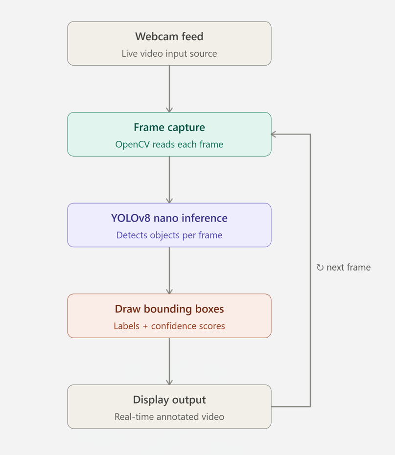
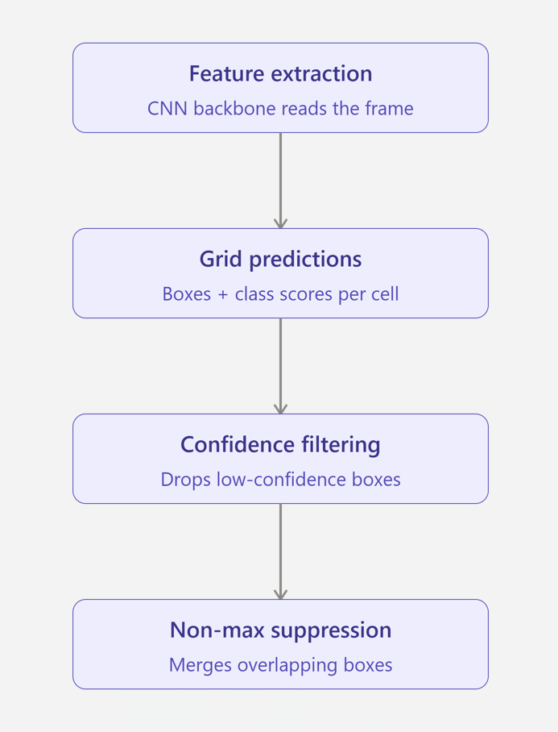
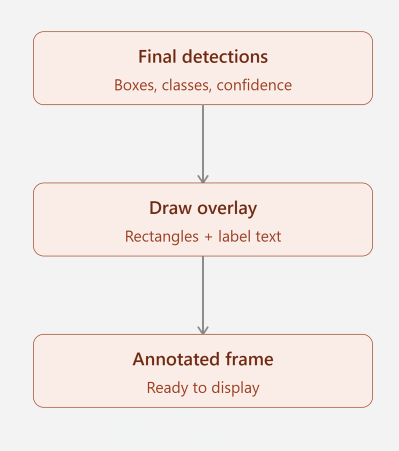

# YOLOv8 Real-Time Object Detection 

This project demonstrates **real-time object detection using YOLOv8 and OpenCV** with a webcam feed.

---

## Demo

<table>
  <tr>
    <td align="center">
       
      Live detection output
    </td>
    <td align="center">
       
      Bounding box overlay
    </td>
    <td align="center">
       
      Project in action
    </td>
  </tr>
</table>

---

## Features
- Real-time object detection
- Uses YOLOv8 Nano (fast & lightweight)
- Webcam-based live inference
- Beginner-friendly implementation

---

## Technologies Used
- Python 
- YOLOv8 (Ultralytics)
- OpenCV

---